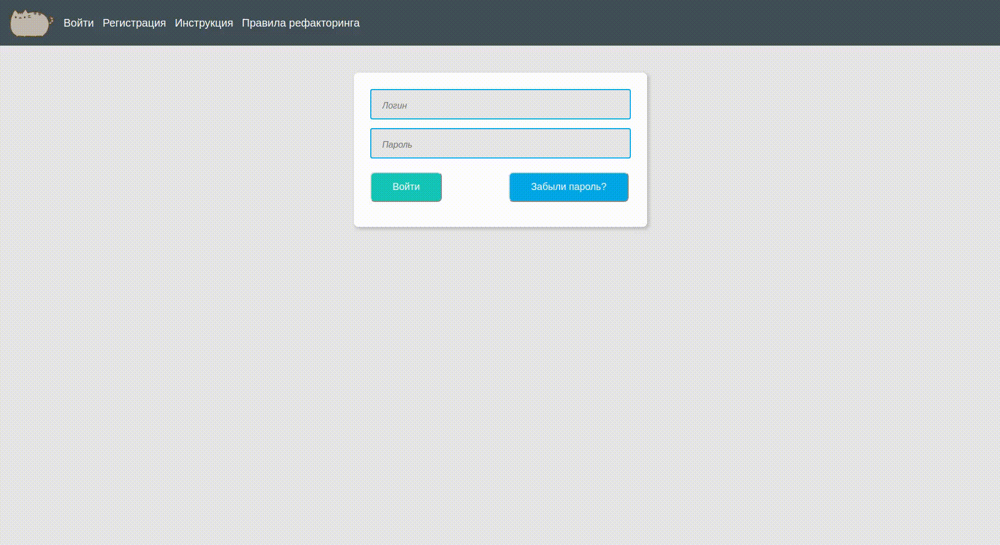

# These actions will help you deploy the project:
## 1.   Create a file **.env** in your project (next to manage.py)
## 2.   Add these constants to it:
* SECRET_KEY="<your_secret_key>"
## 3.   Make this command in the first console window:
sudo docker-compose up --build
## 4.   Make these commands in the second console window:
* docker-compose exec web python manage.py makemigrations
* docker-compose exec web python manage.py migrate

# Work of the app

# Used refactoring rules
* Names of functions and methods that return bool should start with «is» prefix
* Names of functions and methods that return another type should start with «get» prefix
* All functions and methods have snake_case naming style
* All classes have CapWords naming style
* Every function and class has documentation
* Every function has type hinting
* Every function's argument has type hinting
