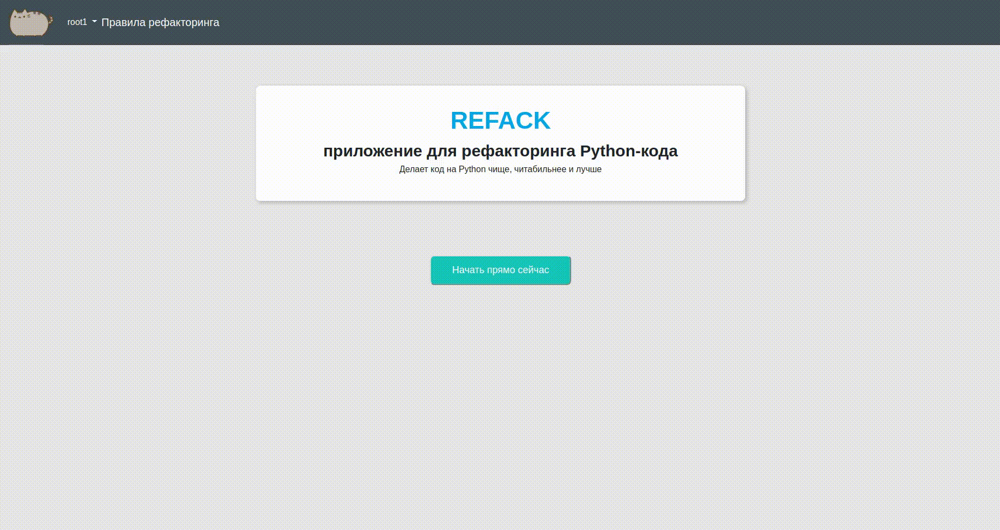

# REFACK


## What is REFACK?
REFACK is a web application for refactoring Python code.
REFACK parse your code and checks on different rules:
- All functions and methods have **snake_case** naming style;
- All classes have **CapWords** naming style;
- All functions, methods and classes have **documentation**;
- If function / method returns boolean, its name should starts with **«is» prefix**;
- If function / method returns not boolean, its name should starts with **«get» prefix**;
- All functions and methods have **type hints**;
- All arguments for functions / methods have **type hints**.

## Requirements
Python 3.10, Django, Docker.

See requirements.txt for the Python modules.

## Deploy
Create a file **.env** in your project (next to manage.py) with this data:
```env
SECRET_KEY="<your_secret_key>"
```

Run the project
```bash
sudo docker-compose up --build
```

Make migrations
```bash
docker-compose exec web python manage.py makemigrations
```

Run migrations
```bash
docker-compose exec web python manage.py migrate
```

## Tests
```bash
# Run all tests
docker-compose exec web python manage.py test

# Run tagged tests
docker-compose exec web python manage.py test --tag=<tag>
```

Tags
- **account_urls** - Test urls for account app;
- **refactoring_urls** - Test urls for refactoring app.
- **refactoring_recommendation** - Test RefactoringRecommendation model